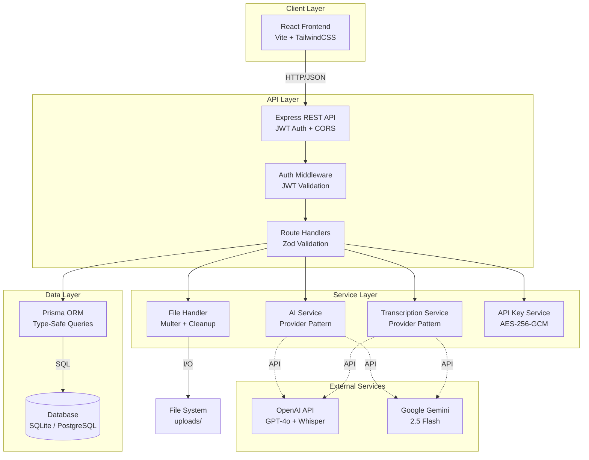

# AI Meeting Copilot

[](https://opensource.org/licenses/MIT)
[](https://nodejs.org/)
[](https://www.typescriptlang.org/)
[](#testing)

AI-powered meeting assistant that transcribes audio and video recordings, generates executive summaries, extracts action items, and tracks decisions. Users bring their own API key — no shared credentials, no hidden costs.

---

## Features

- **Audio Transcription** — Supports MP3, WAV, M4A, MP4, and WebM via OpenAI Whisper or Google Gemini
- **AI Summarization** — Concise executive summaries from full meeting transcripts
- **Action Item Extraction** — Automatically identifies tasks, owners, and due dates
- **Decision Tracking** — Captures key decisions made during meetings
- **Per-User API Keys** — Users supply and manage their own Gemini or OpenAI key via the Settings page; keys are encrypted at rest with AES-256-GCM
- **Model Selection** — Users choose their preferred model (Gemini 2.5 Flash, GPT-4o-mini, etc.) from the Settings page
- **Secure Authentication** — JWT tokens in httpOnly cookies; all data is user-isolated
- **Modern UI** — Responsive React interface with drag-and-drop file upload

---

## Architecture



### Key Design Patterns

- **Provider Pattern** — Pluggable AI and transcription services with a stub implementation for zero-config development
- **Per-User Key Injection** — API keys are decrypted at request time and injected into provider constructors; the raw key is never logged or stored in plaintext
- **Repository Pattern** — Prisma ORM abstracts all database access with full type safety
- **Retry Logic** — Exponential backoff on all external API calls

---

## Tech Stack

### Backend

| Concern        | Technology                   |
| -------------- | ---------------------------- |
| Runtime        | Node.js 20                   |
| Framework      | Express.js                   |
| Language       | TypeScript 5.4               |
| Database ORM   | Prisma (SQLite / PostgreSQL) |
| Authentication | JWT + bcrypt                 |
| Validation     | Zod                          |
| File Upload    | Multer                       |
| Encryption     | Node.js crypto (AES-256-GCM) |
| Testing        | Jest + Supertest             |

### Frontend

| Concern     | Technology     |
| ----------- | -------------- |
| Framework   | React 19       |
| Build Tool  | Vite           |
| Styling     | TailwindCSS    |
| Routing     | React Router 6 |
| State       | Zustand        |
| HTTP Client | Axios          |
| Icons       | Lucide React   |

### Infrastructure

- Docker + Docker Compose for production deployment
- PostgreSQL 16 for production database
- Multi-stage Dockerfile for minimal image size

---

## Project Structure

```
ai-meeting-copilot/
├── docs/
│   ├── API.md                   # Complete API reference
│   └── DETAILED_GUIDE.md        # Deployment and technical guide
├── server/
│   ├── prisma/
│   │   ├── migrations/          # Prisma migration history
│   │   └── schema.prisma        # Database schema
│   └── src/
│       ├── middleware/
│       │   └── auth.ts          # JWT authentication middleware
│       ├── routes/
│       │   ├── apiKey.ts        # API key management (save, delete, status)
│       │   ├── auth.ts          # Register, login, logout
│       │   ├── health.ts        # Health check
│       │   └── meetings.ts      # Meeting CRUD, upload, process
│       ├── services/
│       │   ├── ai/
│       │   │   ├── gemini.ts    # Google Gemini provider
│       │   │   ├── openai.ts    # OpenAI provider
│       │   │   ├── provider.ts  # AIProvider interface
│       │   │   └── stub.ts      # Stub for development
│       │   └── transcription/
│       │       ├── gemini-transcriber.ts
│       │       ├── provider.ts  # TranscriptionProvider interface
│       │       ├── stub.ts
│       │       └── whisper.ts
│       ├── tests/
│       │   ├── apiKey.test.ts
│       │   ├── auth.test.ts
│       │   ├── meetings.test.ts
│       │   └── setup.ts
│       ├── utils/
│       │   ├── encryption.ts    # AES-256-GCM encrypt/decrypt
│       │   ├── jwt.ts
│       │   └── parsing.ts
│       ├── db.ts                # Prisma client singleton
│       ├── env.ts               # Validated environment variables (Zod)
│       ├── index.ts             # Express app entry point
│       └── types.ts             # Shared TypeScript types
├── web/
│   └── src/
│       ├── components/
│       │   ├── ui/              # Button, Badge, Card, Spinner, etc.
│       │   ├── CreateMeetingModal.tsx
│       │   ├── DeleteMeetingModal.tsx
│       │   ├── FileDrop.tsx
│       │   ├── Layout.tsx
│       │   └── ProtectedRoute.tsx
│       ├── lib/
│       │   └── api.ts           # Axios API client
│       ├── pages/
│       │   ├── Dashboard.tsx
│       │   ├── Login.tsx
│       │   ├── MeetingDetail.tsx
│       │   ├── Register.tsx
│       │   └── Settings.tsx     # API key and model configuration
│       ├── store/
│       │   └── auth.ts          # Zustand auth store
│       ├── App.tsx
│       ├── index.css
│       └── main.tsx
├── .dockerignore
├── .gitignore
├── CONTRIBUTING.md
├── docker-compose.yml
├── Dockerfile
├── LICENSE
├── package.json                 # Workspace root
└── README.md
```

---

## Quick Start

### Prerequisites

- Node.js 20 or higher
- npm

### 1. Clone and install

```bash
git clone https://github.com/hasancoded/ai-meeting-copilot.git
cd ai-meeting-copilot
cd server && npm install && cd ../web && npm install && cd ..
```

### 2. Configure the backend

```bash
cp server/.env.development.example server/.env.development
```

The minimum required values in `server/.env.development`:

```env
PORT=4000
NODE_ENV=development
FRONTEND_URL=http://localhost:5173
DATABASE_URL="file:./dev.db"

# Generate with: node -e "console.log(require('crypto').randomBytes(32).toString('hex'))"
JWT_SECRET=your_jwt_secret_min_32_chars
ENCRYPTION_SECRET=your_encryption_secret_min_32_chars

# Use stub for development — no API key required
AI_PROVIDER=stub
TRANSCRIBE_PROVIDER=stub
```

### 3. Configure the frontend

```bash
cp web/.env.example web/.env
# VITE_API_URL is already set to http://localhost:4000
```

### 4. Run database migrations

```bash
cd server
DATABASE_URL="file:./dev.db" npx prisma migrate dev
```

### 5. Start the servers

```bash
# Terminal 1 — backend
cd server && npm run dev

# Terminal 2 — frontend
cd web && npm run dev
```

Open [http://localhost:5173](http://localhost:5173).

---

## Usage

1. **Register** — Create an account with email and password
2. **Configure API Key** — Go to Settings, choose a provider (Gemini or OpenAI) and model, paste your API key
3. **Create a Meeting** — Click "New Meeting" and enter a title
4. **Upload Audio** — Drag and drop or select an audio/video file (max 100 MB)
5. **Process Meeting** — Click "Process Meeting" to transcribe and analyze
6. **View Results** — Switch between tabs for Summary, Transcript, Action Items, and Decisions

> For development without an API key, leave `AI_PROVIDER=stub` and `TRANSCRIBE_PROVIDER=stub`. The stub provider returns realistic-looking synthetic data so the full UI can be exercised without incurring API costs.

---

## API Endpoints

Full documentation: [docs/API.md](docs/API.md)

### Authentication

| Method | Path                 | Description    |
| ------ | -------------------- | -------------- |
| POST   | `/api/auth/register` | Create account |
| POST   | `/api/auth/login`    | Authenticate   |
| POST   | `/api/auth/logout`   | End session    |

### Meetings

| Method | Path                        | Description            |
| ------ | --------------------------- | ---------------------- |
| GET    | `/api/meetings`             | List user's meetings   |
| POST   | `/api/meetings`             | Create meeting         |
| GET    | `/api/meetings/:id`         | Get meeting details    |
| POST   | `/api/meetings/:id/upload`  | Upload audio file      |
| POST   | `/api/meetings/:id/process` | Transcribe and analyze |
| DELETE | `/api/meetings/:id`         | Delete meeting         |

### User Settings

| Method | Path                       | Description                                  |
| ------ | -------------------------- | -------------------------------------------- |
| GET    | `/api/user/api-key/status` | Check API key status (never returns the key) |
| PUT    | `/api/user/api-key`        | Save or update API key, provider, and model  |
| DELETE | `/api/user/api-key`        | Remove saved API key                         |

### Health

| Method | Path          | Description      |
| ------ | ------------- | ---------------- |
| GET    | `/api/health` | API status check |

---

## Environment Variables

### Server (`server/.env.development` or `server/.env.production`)

| Variable              | Required | Description                                                    |
| --------------------- | -------- | -------------------------------------------------------------- |
| `JWT_SECRET`          | Yes      | JWT signing secret — minimum 32 characters                     |
| `ENCRYPTION_SECRET`   | Yes      | AES-256-GCM key for API key encryption — minimum 32 characters |
| `DATABASE_URL`        | Yes      | Prisma database connection string                              |
| `PORT`                | No       | Server port (default: `4000`)                                  |
| `NODE_ENV`            | No       | `development` or `production`                                  |
| `FRONTEND_URL`        | No       | CORS allowed origin (default: `http://localhost:5173`)         |
| `AI_PROVIDER`         | No       | `stub`, `gemini`, or `openai` (default: `stub`)                |
| `TRANSCRIBE_PROVIDER` | No       | `stub`, `gemini`, or `whisper` (default: `stub`)               |

> `GEMINI_API_KEY` and `OPENAI_API_KEY` are not required at the server level. Each user supplies their own key through the Settings page. The server encrypts it with `ENCRYPTION_SECRET` before storing it in the database.

### Frontend (`web/.env`)

| Variable       | Required | Description                                             |
| -------------- | -------- | ------------------------------------------------------- |
| `VITE_API_URL` | Yes      | Backend API base URL (default: `http://localhost:4000`) |

---

## Testing

```bash
cd server
npm test
```

48 tests covering authentication, meeting CRUD, file upload, processing pipeline, API key management, and error handling. Tests run against a dedicated in-memory SQLite database and use stub AI/transcription providers — no real API keys required.

---

## Production Deployment

### Docker Compose

```bash
# Copy and edit production environment
cp server/.env.production.example server/.env.production
# Edit: set JWT_SECRET, ENCRYPTION_SECRET, DATABASE_URL, FRONTEND_URL
# Leave AI_PROVIDER=gemini and TRANSCRIBE_PROVIDER=gemini (users supply their own keys)

docker-compose up -d
```

### Manual checklist before going live

- [ ] `JWT_SECRET` — unique, 64+ character hex value
- [ ] `ENCRYPTION_SECRET` — unique, 64+ character hex value (if rotated, existing users must re-enter their key)
- [ ] `DATABASE_URL` — PostgreSQL connection string
- [ ] `FRONTEND_URL` — production frontend domain
- [ ] `AI_PROVIDER` and `TRANSCRIBE_PROVIDER` set to `gemini` or `openai`

---

## Contributing

Contributions are welcome. Please read [CONTRIBUTING.md](CONTRIBUTING.md) before opening a pull request.

---

## License

MIT — see [LICENSE](LICENSE).
