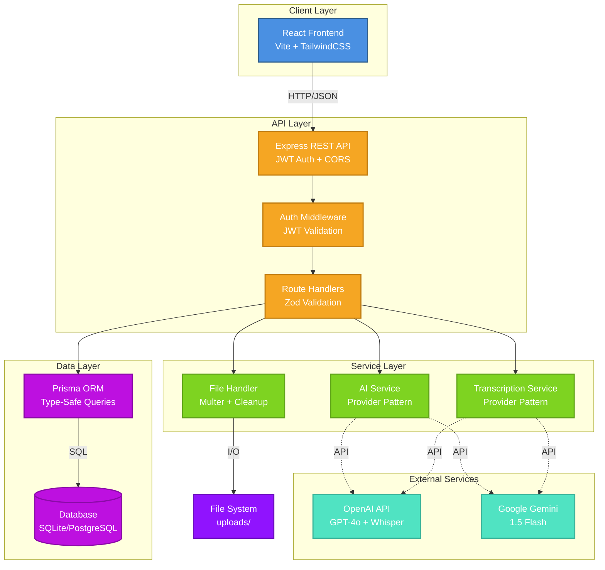

# AI Meeting Copilot

[](https://opensource.org/licenses/MIT)
[](https://nodejs.org/)
[](https://www.typescriptlang.org/)

AI-powered meeting assistant that transcribes audio/video files, generates summaries, extracts action items, and builds a searchable knowledge base. Built with Node.js, Express, React, and Google Gemini AI.

## Features

- **Audio Transcription**: Upload meeting recordings and get accurate transcriptions using OpenAI Whisper or Google Gemini
- **AI Summarization**: Automatic executive summaries powered by GPT-4o-mini or Gemini 1.5 Flash
- **Action Item Extraction**: Automatically identify tasks, owners, and due dates from meeting discussions
- **Decision Tracking**: Capture and organize key decisions made during meetings
- **Secure Authentication**: JWT-based authentication with httpOnly cookies
- **User Isolation**: Each user can only access their own meetings
- **File Management**: Support for multiple audio/video formats (MP3, WAV, M4A, MP4, WebM)
- **Modern UI**: Responsive React interface with drag-and-drop file upload

## Architecture

The AI Meeting Copilot follows a modern three-tier architecture with clear separation of concerns and scalable design patterns.



### Key Design Patterns

- **Provider Pattern**: Pluggable AI and transcription services with stub implementations for development
- **Middleware Chain**: Authentication, validation, and error handling as composable middleware
- **Repository Pattern**: Prisma ORM abstracts database operations with type safety
- **Service Layer**: Business logic separated from HTTP concerns for testability
- **Retry Logic**: Exponential backoff for external API calls with circuit breaker pattern

### Data Flow

1. **Upload Flow**: Client → API → File Validation → Storage → Database Record
2. **Processing Flow**: Client → API → File Retrieval → Transcription Service → AI Service → Database Update
3. **Authentication Flow**: Client → Login → JWT Generation → HttpOnly Cookie → Protected Routes

## Tech Stack

### Backend

- **Runtime**: Node.js 20
- **Framework**: Express.js
- **Language**: TypeScript
- **Database**: Prisma ORM (SQLite for development, PostgreSQL for production)
- **Authentication**: JWT + bcrypt
- **Validation**: Zod
- **Testing**: Jest + Supertest (36 tests, all passing)
- **File Upload**: Multer
- **AI**: OpenAI (GPT-4o-mini + Whisper) or Google Gemini (1.5 Flash)

### Frontend

- **Framework**: React 19
- **Build Tool**: Vite
- **Styling**: TailwindCSS
- **Language**: TypeScript
- **Routing**: React Router 6
- **State Management**: Zustand
- **Forms**: React Hook Form + Zod
- **HTTP Client**: Axios
- **Notifications**: Sonner
- **File Upload**: React Dropzone
- **Icons**: Lucide React

### DevOps

- **Containerization**: Docker + Docker Compose
- **Database**: PostgreSQL 16 (production)
- **Deployment**: Multi-stage production build

## Quick Start

### Prerequisites

- Node.js 20 or higher
- npm or yarn
- SQLite (development)
- Docker (optional, for production)

### Installation

1. **Clone the repository**

```bash
git clone https://github.com/hasancoded/ai-meeting-copilot.git
cd ai-meeting-copilot
```

2. **Install backend dependencies**

```bash
cd server
npm install
```

3. **Install frontend dependencies**

```bash
cd ../web
npm install
```

4. **Configure backend environment**

```bash
cd server
cp .env.development.example .env.development
```

Edit `.env.development` and set your configuration:

```env
PORT=4000
NODE_ENV=development
FRONTEND_URL=http://localhost:5173
JWT_SECRET=your_32_character_secret_key_here
DATABASE_URL="file:./dev.db"
AI_PROVIDER=stub
TRANSCRIBE_PROVIDER=stub
```

For production use with real AI providers, set:

```env
# For Google Gemini (recommended)
AI_PROVIDER=gemini
TRANSCRIBE_PROVIDER=gemini
GEMINI_API_KEY=your-actual-gemini-api-key-here

# OR for OpenAI
AI_PROVIDER=openai
TRANSCRIBE_PROVIDER=whisper
OPENAI_API_KEY=your-actual-openai-api-key-here
```

5. **Configure frontend environment**

```bash
cd web
cp .env.example .env
```

Edit `.env`:

```env
VITE_API_URL=http://localhost:4000
```

6. **Run database migrations**

```bash
cd server
npx prisma migrate dev
```

7. **Start the backend**

```bash
cd server
npm run dev
```

Server runs on `http://localhost:4000`

8. **Start the frontend** (in a separate terminal)

```bash
cd web
npm run dev
```

Frontend runs on `http://localhost:5173`

9. **Open your browser**

Navigate to `http://localhost:5173` and start using the application!

## Usage

1. **Register** - Create an account with email and password
2. **Login** - Authenticate and receive JWT cookie
3. **Create Meeting** - Click "New Meeting" and enter a title
4. **Upload Audio** - Drag and drop or select an audio/video file
5. **Process Meeting** - Click "Process Meeting" to transcribe and analyze
6. **View Results** - Navigate between tabs to see:
   - Summary: AI-generated executive summary
   - Transcript: Full meeting transcription
   - Action Items: Extracted tasks with owners and due dates
   - Decisions: Key decisions made during the meeting

## Testing

### Backend Tests

```bash
cd server
npm test
```

All 36 tests should pass, covering:

- Authentication flows
- Meeting CRUD operations
- File upload handling
- Processing pipeline
- User isolation
- Error scenarios

### Frontend Linting

```bash
cd web
npm run lint
```

## Production Deployment

### Using Docker

1. **Configure production environment**

```bash
cp server/.env.production.example server/.env.production
```

Edit with production values (PostgreSQL connection, API keys, etc.)

2. **Build and start with Docker Compose**

```bash
docker-compose up -d
```

3. **Check logs**

```bash
docker-compose logs -f server
```

## Project Structure

```
ai-meeting-copilot/
├── docs/
│   ├── API.md                                  # Complete API reference
│   └── DETAILED_GUIDE.md                       # Comprehensive technical guide
├── server/
│   ├── prisma/
│   │   ├── migrations/
│   │   └── schema.prisma
│   ├── src/
│   │   ├── middleware/
│   │   │   └── auth.ts
│   │   ├── routes/
│   │   │   ├── auth.ts
│   │   │   ├── health.ts
│   │   │   └── meetings.ts
│   │   ├── services/
│   │   │   ├── ai/
│   │   │   │   ├── gemini.ts
│   │   │   │   ├── openai.ts
│   │   │   │   ├── provider.ts
│   │   │   │   └── stub.ts
│   │   │   └── transcription/
│   │   │       ├── gemini-transcriber.ts
│   │   │       ├── provider.ts
│   │   │       ├── stub.ts
│   │   │       └── whisper.ts
│   │   ├── tests/
│   │   ├── utils/
│   │   ├── db.ts
│   │   ├── env.ts
│   │   ├── index.ts
│   │   └── types.ts
│   ├── .env.development.example
│   ├── .env.production.example
│   ├── jest.config.js
│   ├── package.json
│   └── tsconfig.json
├── web/
│   ├── src/
│   │   ├── components/
│   │   │   ├── ui/
│   │   │   ├── CreateMeetingModal.tsx
│   │   │   ├── FileDrop.tsx
│   │   │   ├── Layout.tsx
│   │   │   └── ProtectedRoute.tsx
│   │   ├── lib/
│   │   │   └── api.ts
│   │   ├── pages/
│   │   │   ├── Dashboard.tsx
│   │   │   ├── Login.tsx
│   │   │   ├── MeetingDetail.tsx
│   │   │   └── Register.tsx
│   │   ├── store/
│   │   │   └── auth.ts
│   │   ├── App.tsx
│   │   ├── index.css
│   │   └── main.tsx
│   ├── .env.example
│   ├── index.html
│   ├── package.json
│   ├── tailwind.config.js
│   ├── tsconfig.json
│   └── vite.config.ts
├── .dockerignore
├── .gitignore
├── CONTRIBUTING.md
├── docker-compose.yml
├── Dockerfile
├── LICENSE
├── package.json
└── README.md
```

## API Endpoints

See [docs/API.md](docs/API.md) for complete API documentation.

### Authentication

- `POST /api/auth/register` - Create account
- `POST /api/auth/login` - Authenticate
- `POST /api/auth/logout` - End session

### Meetings

- `GET /api/meetings` - List user's meetings
- `POST /api/meetings` - Create new meeting
- `GET /api/meetings/:id` - Get meeting details
- `POST /api/meetings/:id/upload` - Upload audio file
- `POST /api/meetings/:id/process` - Transcribe and analyze

### Health

- `GET /api/health` - API status check

## Environment Variables

### Backend (server/.env)

#### Required

- `JWT_SECRET` - Secret key for JWT tokens (minimum 32 characters)
- `DATABASE_URL` - Database connection string

#### Optional

- `PORT` - Server port (default: 4000)
- `NODE_ENV` - Environment mode (default: development)
- `FRONTEND_URL` - CORS origin (default: http://localhost:5173)
- `AI_PROVIDER` - AI service (stub | openai | gemini, default: stub)
- `TRANSCRIBE_PROVIDER` - Transcription service (stub | whisper | gemini, default: stub)
- `OPENAI_API_KEY` - OpenAI API key (required if using openai providers)
- `GEMINI_API_KEY` - Google Gemini API key (required if using gemini providers)

### Frontend (web/.env)

#### Required

- `VITE_API_URL` - Backend API URL (default: http://localhost:4000)

## Contributing

Contributions are welcome! Please see [CONTRIBUTING.md](CONTRIBUTING.md) for guidelines.

## License

This project is licensed under the MIT License - see the [LICENSE](LICENSE) file for details.

## Acknowledgments

- OpenAI for GPT-4o-mini and Whisper APIs
- Google for Gemini AI
- Prisma team for excellent ORM
- Express.js community
- React and Vite teams
- TailwindCSS for utility-first CSS
- Zustand for lightweight state management

## Support

For issues and questions:

- Check [docs/API.md](docs/API.md) for API details
- Review [docs/DETAILED_GUIDE.md](docs/DETAILED_GUIDE.md) for comprehensive technical documentation
- Review backend tests for usage examples
